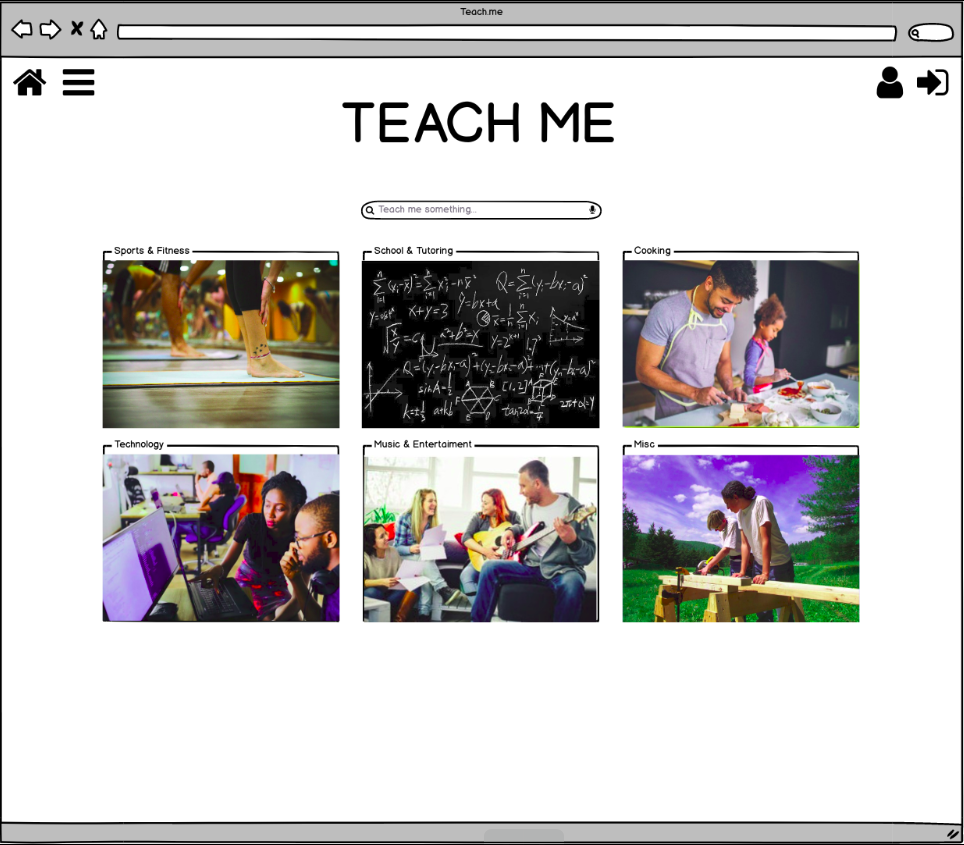
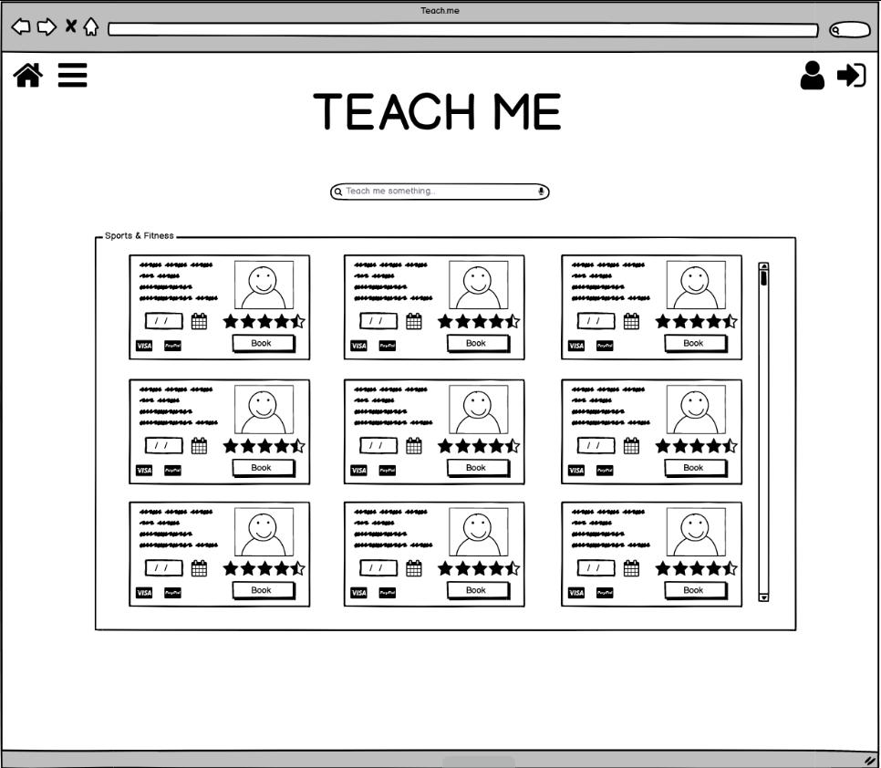
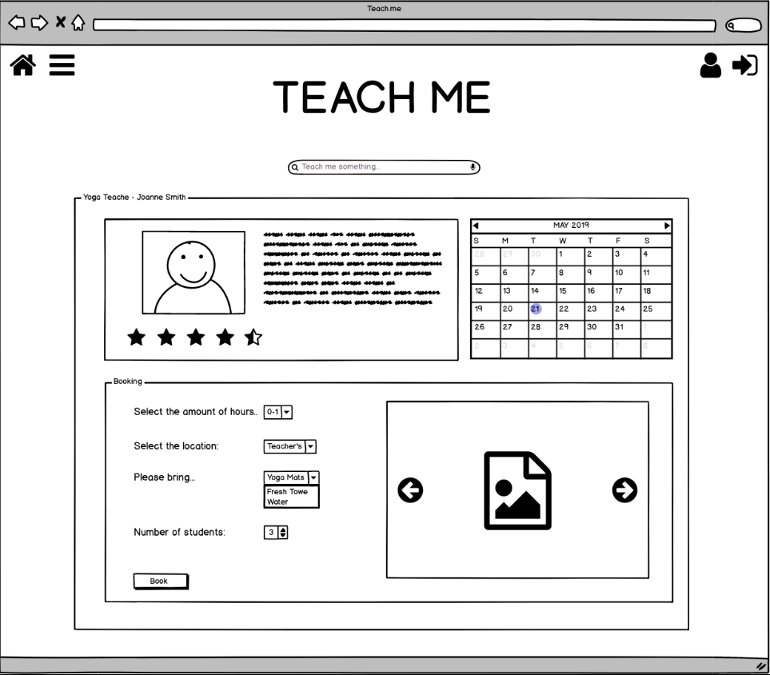
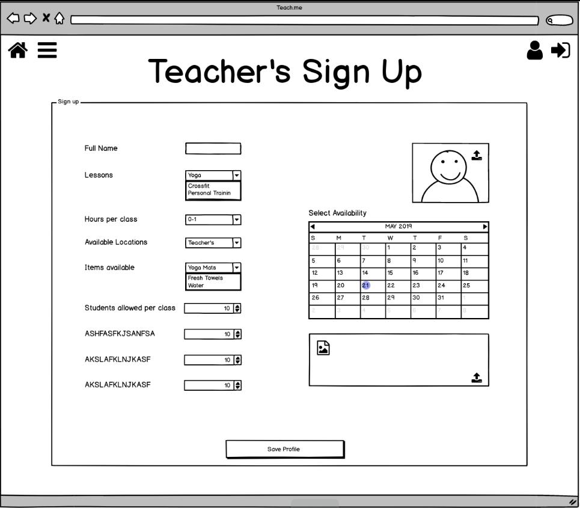

## C33 Pitch Day Projects

Begin by issuing pull requests for the first two issues in this repository.

After the instructor advisor for the project merges the pull requests, coding may begin on the project.

Example of embedded image in Markdown in README.md:

